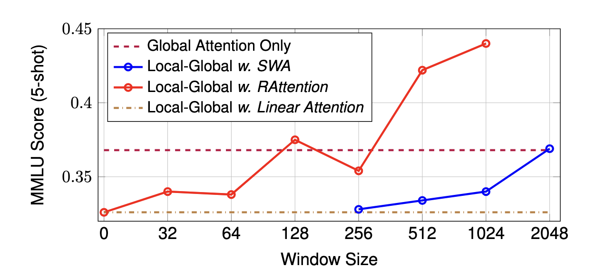
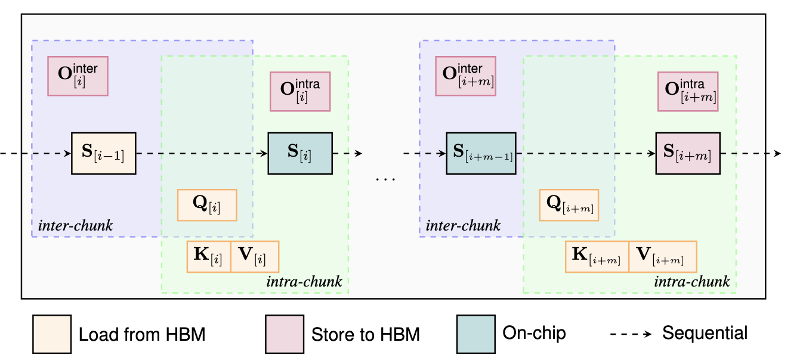

# ⚡ RAttention: Towards the Minimal Sliding Window Size in Local-Global Attention Models

## 📌 TL;DR

Local-global attention models have recently gained traction as efficient alternatives to standard Transformers, offering improvements in both training and inference speed. But one practical question remains:

> **What is the *smallest* sliding window size we can get away with? 🤔**

**Short answer:** You can replace a standard sliding window attention mechanism with a window size of 4K with **RAttention** using a **512-token window** — *without* compromising performance or training speed. In fact, you actually gain **better long-context understanding**. 🚀

---

## 🧠 Introduction

Frontier models often adopt conservative window sizes. For example, both **Mistral** and **Gemma 2** use a 4096-token window within an 8192-token pretraining context. As a result, the efficiency benefits of Sliding Window Attention (SWA) only manifest with relatively long sequences.

To illustrate: A 12B-parameter local-global attention model using a 4K window shows **no KV cache savings** for sequences ≤ 4K tokens. However, reducing the window to **1K** yields **~56% KV cache savings**. 💾

Unfortunately, *naively* shrinking the window hurts performance (see blue curve below).
That’s where **RAttention** comes in — it integrates **Residual Linear Attention (RLA)** to recover context from tokens outside the window. This allows us to dramatically reduce the window size while preserving (or improving) quality. ✅

  
  
Comparison of MMLU 5-shot performance scores across different window sizes at 3B
scale with pretraining context length 4096.

---

## 🧪 Training Efficiency and Parameter Efficiency

Our linear attention kernels incorporate two key optimizations — **fused operations** and **flexible state saving** (as shown below). As a result, you can train **RAttention with a 512-token window** just as efficiently as **Sliding Window Attention with a 4K window**. ⚡

  
  
Our training and prefilling kernels use an interleaved state-saving pattern. See the paper for more details. 🔄💡

Importantly, our linear attention is **parameter-free** — it shares all parameters with the standard local attention and **introduces no additional weights**. ✅

---

## 🔮 Follow-up

Using vanilla linear attention (i.e., no gating, simple additive update rule), we already observe significant benefits from reducing the sliding window size. We believe this signals the potential for even greater gains by designing **more sophisticated linear models** (such as DeltaNet or Mesa Layers).

We encourage future efforts to explore **efficient models within the global–local framework**, striking a balance between simplicity and expressiveness — **without compromising performance or parameter efficiency**. Such models are often more practically useful than pure linear methods, offering a powerful way to handle long contexts while keeping computational and memory costs manageable. 🌟

---

## 🧰 Related Work

Besides RAttention, our team at Apple has also open-sourced high-performance Pallas implementations of other linear models:

-  [**Mamba kernels**](https://github.com/apple/axlearn/blob/main/axlearn/common/ssm_kernels/mamba_kernels.py)
-  [**Mamba2 kernels**](https://github.com/apple/axlearn/blob/main/axlearn/common/ssm_kernels/ssd_kernels.py)
-  [**Jamba models**](https://github.com/apple/axlearn/blob/main/axlearn/common/ssm.py) (supports either Mamba or Mamba2)

Check them out! 📨
