# Infrastructure

**This doc is still under construction.**

This document describes the various components that power AXLearn training on the public cloud.

## Bastion Orchestrator

The Bastion is a simple orchestrator which supports flexible job scheduling and quota management. It is general purpose (i.e., it supports scheduling jobs with arbitrary bash workloads), but also provides out-of-box functionality for provisioning, running, and monitoring large TPU slices.

While the bastion currently only supports Google Cloud Platform (GCP) jobs, its design is cloud agnostic, and in theory, it can be extended to run on other cloud providers.

Its main dependencies are:
- A cloud bucket for reading and writing job metadata and logs.
  - This should be compatible with [`tensorflow.io`](https://www.tensorflow.org/api_docs/python/tf/io).
  - This should be **writable** by the bastion and anyone who intends to submit jobs.
- A cloud bucket (possibly the same bucket) for reading quota information.
  - This should also be compatible with `tensorflow.io`.
  - This should be **readable** by the bastion and anyone who intends to submit jobs.
- A docker repo to pull the bastion container image from.
- A single VM to run on.

Please see [below](#control-flow-of-job-submission) for a high-level diagram of the bastion job submission.

The following sections guide you through setting up and launching a job via Bastion.

<br>

### Pre-requisites

We assume you have:
1. Followed the [getting started setup](01-start.md#launching-training).
2. A docker repo that can be accessed from Bastion. For the purposes of this doc, we assume this repo lives in [Artifact Registry](https://cloud.google.com/artifact-registry).

We also assume you have "activated" a project config using `axlearn gcp config activate`. This is mainly a convenience so that you do not have to specify mundane flags like `--project` and `--zone` in every command. Please refer to the [CLI docs](03-cli.md) for more details.

<br>

### Setting Up

This section will setup a bastion named `$USER-bastion`, but feel free to use a different name, as long as it isn't too long (VM names are capped at 63 chars) and ends with `-bastion`.

As usual, please make sure you have authenticated to GCP:
```bash
# Authenticate to GCP.
axlearn gcp auth
```

We first build a Docker image using the default `Dockerfile` in the repo:
```bash
# Create and push a bastion image to the Artifact Registry.
axlearn gcp bundle --name=$USER-bastion --bundler_type=artifactregistry \
    --bundler_spec=image=base --bundler_spec=dockerfile=Dockerfile --bundler_spec=target=bastion
```

> For more details behind the `--bundler_*` flags, please refer to the [CLI docs](03-cli.md).

Next, we create a quota file, which defines things like quota groups and membership. A quota file has the following format:
```toml
[toml-schema]
version = "1"

[total_resources]
v4 = 1024

[project_membership]
project1 = ["user1", "user2"]
project2 = ["user1", "user3"]

[project_resources.project1]
v4 = 0.6

[project_resources.project2]
v4 = 0.4
```

In the above example, we configure a pool of `1024` v4 TPU cores, where 60% of the pool is reserved for `project1` and 40% is reserved for `project2`. Note that these are not hard limits -- if `project1` _underutilizes_ its share of the pool, `project2` can utilize the spare resources on a "best effort" basis. If utilization goes back up for `project1`, some jobs in `project2` may be pre-empted.

In short, the quota file is a `toml` file that specifies:
- The total quota pool by resource type;
- The membership by project;
- The per-project resources, expressed as fractions of the total pool.

Once ready, upload the file to the `private_bucket` configured when [preparing the CLI](01-start.md#preparing-the-cli), under the following path:
```
gs://PRIVATE_BUCKET/$USER-bastion/project-quotas/project-quotas.config
```

Note that the `$USER-bastion` must match the bastion name that you picked above.

Finally, launch the bastion (which runs as a single VM):
```bash
# Creates a VM and runs the bastion image on it.
axlearn gcp bastion create --name=$USER-bastion
```

Once again, the name of the bastion should match the name of the bundle produced above, as well as the path in the quota file.

When the bastion is booted, you can view logs at:
```bash
gsutil cat gs://PERMANENT_BUCKET/$USER-bastion/logs/$USER-bastion
```
Where the bucket name comes from the `permanent_bucket` configured when [preparing the CLI](01-start.md#preparing-the-cli).

For more details on useful log paths, run `axlearn gcp bastion --help`.

<br>

### Launching a Job

Once the bastion is up and running, you can submit arbitrary jobs for it to run. These jobs are essentially [`BastionJobSpec`](https://github.com/apple/axlearn/blob/70eb15ffe7285cb97287b8665b91559e4b23726e/axlearn/cloud/gcp/jobs/bastion_vm.py#L235)s serialized as json blobs, typically constructed via Python scripting using the bastion API[1].

In most cases, you can use the `axlearn gcp launch` command which handles most of these details for you.

For example, to launch a Python command with `axlearn gcp launch`:
```bash
# Launch a v4-32 job via Bastion.
# Note: the "'...'" quotes are important.
axlearn gcp launch --instance_type=tpu-v4-32 --bastion=$USER-bastion -- python3 -c "'import jax; print(jax.devices())'"
```

This submits a `BastionJobSpec` with the command `python3 -c 'import jax; print(jax.devices())'`, to be scheduled and run on a TPU v4-32 slice.

The job itself will have two different types of logs:
- The bastion log: this contains logs visible from the bastion, such as the job and TPU statuses.
- The TPU log(s): this contains logs visible from the actual TPUs, such as the actual job execution outputs.

To launch a command using a specific project's quota, run:
```bash
# Launch a v4-32 job via bastion under project1.
# Note: the "'...'" quotes are important.
axlearn gcp launch --instance_type=tpu-v4-32 --bastion=$USER-bastion --project_id=project1 --user_id=user1 -- python3 -c "'import jax; print(jax.devices())'"
```

For more details on the launch command, run `axlearn gcp launch --help`.

[1] Refer to [new_jobspec](https://github.com/apple/axlearn/blob/70eb15ffe7285cb97287b8665b91559e4b23726e/axlearn/cloud/gcp/jobs/bastion_vm.py#L250) and [serialize_jobspec](https://github.com/apple/axlearn/blob/70eb15ffe7285cb97287b8665b91559e4b23726e/axlearn/cloud/gcp/jobs/bastion_vm.py#L266) as a starting point.

<br>

### Bastion Runners

The bastion supports running arbitrary bash workloads. However, the common case is for the bastion to submit resources to some cloud environment (such as a kubernetes cluster) and monitor those resources until completion.

To facilitate the common case, the launch command exposes a concept of a bastion "runner", which is a configurable object that implements the logic for actually executing commands submitted to the bastion. As an example, the `GKERunnerJob` executes a bastion command by first creating a [jobset](https://github.com/kubernetes-sigs/jobset) in a Google Kubernetes Engine (GKE) cluster, and monitors the jobset until completion, restarting it as necessary. A collection of sample runner implementations can be found in `axlearn/cloud/gcp/runners`.

To target a specific runner, users can provide `--runner_module` and `--runner_name` flags to the launch command, which respectively specifies a Python module (e.g. `axlearn.cloud.gcp.runners`), as well as the name of the runner (e.g. `gke_tpu_single`). The runner module should expose a function `named_runner_configs`, which takes the name of a runner and returns the runner config. By specifying these two flags, the launch command can automatically infer any available flags from the runner config, which are exposed to the user in the launch command.

For backwards compatibility, users can also provide `--instance_type` to the launch command instead of `--runner_module` and `--runner_name`, in which case the launch command will make a best-effort attempt to infer the appropriate runner for the instance type.

For details, please see `axlearn gcp launch --help`.

### Control Flow of Job Submission

```mermaid
%% elk seems to be more maintained, see: https://github.com/mermaid-js/mermaid/issues/1969
%% N.B. elk doesn't stop rendering invisible edge operator, i.e. ~~~
%%{init: {"flowchart": {"defaultRenderer": "elk"}} }%%

flowchart TB

    subgraph UserMachine ["User's dev machine (e.g. MacBook Pro)"]
        localAXLearnPackage(["axlearn package"]):::fileCSS
    end

    localAXLearnPackage --"
        Bundle/upload
        the user's axlearn dir
        (minus excluded paths)"--> bastionPrimaryStore

    localAXLearnPackage =="
        Submit a bastion job
        (serialized as a job spec)"==> bastionPrimaryStore

    subgraph PublicCloud ["Public Cloud (e.g. Google Cloud Platform)"]

        subgraph BastionVM_shared ["Bastion VM (e.g. 'shared-bastion')"]
            bastionScheduler_1["Bastion \n Scheduler"]
            bastionVmAXLearnPackage(["axlearn package \n (running on shared docker image)"]):::fileCSS
            bastionJob_1["Bastion job 1 \n name: notebook-tpu-alice-a59ce1"]
            bastionJob_2["Bastion job 2 \n name: notebook-tpu-bob-b3b5f1"]

            bastionScheduler_1 --"Spawn/kill"--> bastionJob_1 & bastionJob_2
        end

        bastionPrimaryStore[("Data Store \n (e.g. Google Storage)")]:::storeCSS
        bastionPrimaryStore =="Download \n Bastion job specs"==>  bastionScheduler_1

        bastionPrimaryStore --"Download Alice's \n axlearn bundle"--> WorkerVM_1
        bastionPrimaryStore --"Download Bob's \n axlearn bundle"--> WorkerVM_2
        bastionJob_1 --"Provisions/Monitors \n (using Alice's bundle)"--> WorkerVM_1
        bastionJob_2 --"Provisions/Monitors \n (using Bob's bundle)"--> WorkerVM_2

        subgraph WorkerVM_1 ["Worker VM 1 (name: notebook-tpu-alice-a59ce1)"]
            workerProcess_1["User-specified process \n e.g. `jupyter lab --port=12345`"]
            accelerator_1[/"hardware accelerators \n (e.g. TPU v4-8)"\]:::chipCSS
            bastionWorkerAXLearnPackage_1(["axlearn package \n (built by Alice)"]):::fileCSS

            workerProcess_1 --> accelerator_1
        end

        subgraph WorkerVM_2 ["Worker VM 2"]
            workerProcess_2["..."]
            accelerator_2[/"..."\]:::chipCSS
            bastionWorkerAXLearnPackage_2(["..."]):::fileCSS

            workerProcess_2 --> accelerator_2
        end

        bastionLogStore[("Log Store \n (e.g. Google Storage)")]:::storeCSS
        WorkerVM_1 & WorkerVM_2 --"Sync logs"--> bastionLogStore

    end

    bastionLogStore--"Download logs for debug"-->UserMachine

    %% Public Github doesn't apply CSS, but keeping these enables other environments
    %% (e.g. editor previews such as in VS Code) to use more colors
    classDef chipCSS stroke:#333,fill:#163
    classDef fileCSS stroke:#111,fill:#333
    classDef storeCSS fill:#37d
```


### Goodput Monitoring

Please refer to [Goodput Monitoring](docs/05-Goodput-Monitoring.md) for monitoring.
