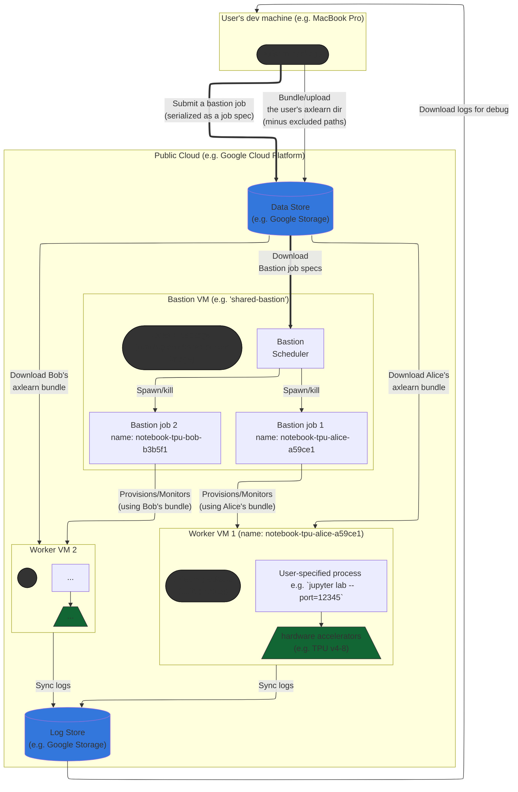

# Bastion: Axlearn's Job Scheduler

## Control Flow of Job Submission

```mermaid
%% elk seems to be more maintained, see: https://github.com/mermaid-js/mermaid/issues/1969
%% N.B. elk doesn't stop rendering invisible edge operator, i.e. ~~~
%%{init: {"flowchart": {"defaultRenderer": "elk"}} }%%

flowchart TB

    subgraph UserMachine ["User's dev machine (e.g. MacBook Pro)"]
        localAXLearnPackage(["axlearn package"]):::fileCSS
    end

    localAXLearnPackage --"
        Bundle/upload
        the user's axlearn dir
        (minus excluded paths)"--> bastionPrimaryStore

    localAXLearnPackage =="
        Submit a bastion job
        (serialized as a job spec)"==> bastionPrimaryStore

    subgraph PublicCloud ["Public Cloud (e.g. Google Cloud Platform)"]

        subgraph BastionVM_shared ["Bastion VM (e.g. 'shared-bastion')"]
            bastionScheduler_1["Bastion \n Scheduler"]
            bastionVmAXLearnPackage(["axlearn package \n (running on shared docker image)"]):::fileCSS
            bastionJob_1["Bastion job 1 \n name: notebook-tpu-alice-a59ce1"]
            bastionJob_2["Bastion job 2 \n name: notebook-tpu-bob-b3b5f1"]

            bastionScheduler_1 --"Spawn/kill"--> bastionJob_1 & bastionJob_2
        end

        bastionPrimaryStore[("Data Store \n (e.g. Google Storage)")]:::storeCSS
        bastionPrimaryStore =="Download \n Bastion job specs"==>  bastionScheduler_1

        bastionPrimaryStore --"Download Alice's \n axlearn bundle"--> WorkerVM_1
        bastionPrimaryStore --"Download Bob's \n axlearn bundle"--> WorkerVM_2
        bastionJob_1 --"Provisions/Monitors \n (using Alice's bundle)"--> WorkerVM_1
        bastionJob_2 --"Provisions/Monitors \n (using Bob's bundle)"--> WorkerVM_2

        subgraph WorkerVM_1 ["Worker VM 1 (name: notebook-tpu-alice-a59ce1)"]
            workerProcess_1["User-specified process \n e.g. `jupyter lab --port=12345`"]
            accelerator_1[/"hardware accelerators \n (e.g. TPU v4-8)"\]:::chipCSS
            bastionWorkerAXLearnPackage_1(["axlearn package \n (built by Alice)"]):::fileCSS

            workerProcess_1 --> accelerator_1
        end

        subgraph WorkerVM_2 ["Worker VM 2"]
            workerProcess_2["..."]
            accelerator_2[/"..."\]:::chipCSS
            bastionWorkerAXLearnPackage_2(["..."]):::fileCSS

            workerProcess_2 --> accelerator_2
        end

        bastionLogStore[("Log Store \n (e.g. Google Storage)")]:::storeCSS
        WorkerVM_1 & WorkerVM_2 --"Sync logs"--> bastionLogStore

    end

    bastionLogStore--"Download logs for debug"-->UserMachine

    %% Public Github doesn't apply CSS, but keeping these enables other environments
    %% (e.g. editor previews such as in VS Code) to use more colors
    classDef chipCSS stroke:#333,fill:#163
    classDef fileCSS stroke:#111,fill:#333
    classDef storeCSS fill:#37d
```
