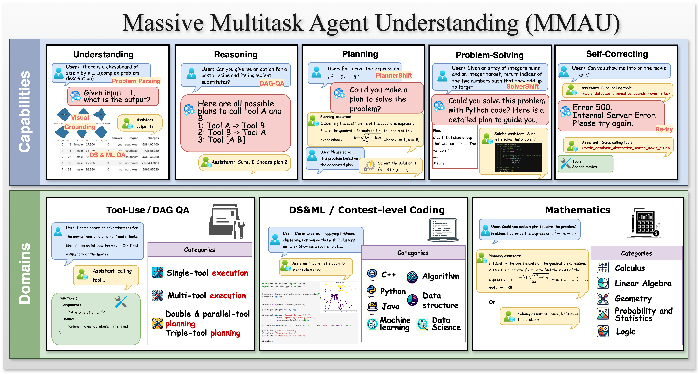

# MMAU: A Holistic Benchmark of Agent Capabilities Across Diverse Domains




[](./README.md#dataset)
[](https://arxiv.org/abs/2407.18961)
[](https://github.com/apple/axlearn/docs/research/mmau)

---

## Introducing MMAU 🎉

The Massive Multitask Agent Understanding (MMAU) benchmark is designed to evaluate the performance of large language models (LLMs) as agents across a wide variety of tasks. It provides comprehensive insights into the capabilities and limitations of these models by featuring extensive offline tasks that eliminate the need for complex environment setups.

MMAU evaluates models across five key domains:
- **Tool-use**
- **Directed Acyclic Graph (DAG) QA**
- **Data Science and Machine Learning Coding**
- **Contest-level Programming**
- **Mathematics**

These domains cover five essential capabilities:
- **Understanding**
- **Reasoning**
- **Planning**
- **Problem-solving**
- **Self-correction**

With a total of 20 meticulously designed tasks encompassing over 3,000 distinct prompts, MMAU offers a robust framework for assessing the strengths and weaknesses of LLM agents.


## Table of Contents

- [Overview](#overview)
- [Dataset Summary](#dataset-summary)
- [Quick Start](#quick-start)
- [Data prepartion](#dataset)
- [Benchmark](#benchmark)
- [Leaderboard](#leaderboard)
- [Citation](#citation)

---

## Overview

### Key Evaluation Results on MMAU


### MMAU key features

- **Comprehensive Evaluation**: MMAU provides evaluations from both application scenarios and fundamental capabilities. This dual approach offers a holistic framework for understanding the strengths and limitations of LLM agents.
- **Simplified Evaluation Process**: The evaluation process on MMAU is straightforward and unified on a static dataset. This method avoids the instability issues that can arise from interactive evaluations, ensuring more reliable and consistent results.
- **Open Access**: We release our evaluation dataset and scripts to the public. This transparency aims to set a new standard for performance assessment in the AI landscape, encouraging further research and development.

### Benchmark Comparison Table
Table 1: Comparison of benchmarks in evaluating core capabilities of LLM agents. “En.” and “Dis.” represent entangled and disentangled, specifically. Understand.: understanding, Reason.: reasoning, Plan.: planning, Prob.-solv.: problem-solving, Self-corr.: self-correction, MM: multimodal grounding.

| Benchmarks    | Understand. En. | Understand. Dis. | Reason. En. | Reason. Dis. | Plan. En. | Plan. Dis. | Prob.-solv. En. | Prob.-solv. Dis. | Self-corr. | MM |
|---------------|-----------------|------------------|-------------|--------------|-----------|------------|-----------------|------------------|------------|----|
| [AgentBench](https://arxiv.org/abs/2308.03688) | ✅               | ❌                | ✅           | ❌            | ✅         | ❌          | ✅               | ❌                | ✅          | ✅  |
| [AgentBoard](https://arxiv.org/abs/2401.13178) | ✅               | ❌                | ✅           | ❌            | ✅         | ❌          | ✅               | ❌                | ✅          | ❌  |
| [PlanBench](https://arxiv.org/abs/2206.10498)  | ✅               | ❌                | ✅           | ❌            | ✅         | ❌          | ✅               | ❌                | ❌          | ❌  |
| [MMLU](https://arxiv.org/abs/2009.03300)        | ✅               | ❌                | ✅           | ❌            | ✅         | ❌          | ✅               | ❌                | ❌          | ❌  |
| [MMMU](https://arxiv.org/abs/2311.16502)       | ✅               | ❌                | ✅           | ❌            | ✅         | ❌          | ✅               | ❌                | ✅          | ❌  |
| MMAU           | ✅               | ✅                | ✅           | ✅            | ✅         | ✅          | ✅               | ✅                | ✅          | ✅  |


MMAU's extensive and meticulously curated dataset, along with its robust evaluation framework, provides a valuable resource for assessing and advancing the capabilities of large language models.


## Dataset Summary

The construction of MMAU encompasses both breadth and depth of data, drawn from a diverse range of sources to ensure comprehensive evaluation across various domains.

Our dataset is constructed from heterogeneous sources, including:

1. **In-house Tool-use Data**: Utilized for tasks under tool-use and Directed Acyclic Graph (DAG) QA, providing a robust foundation for evaluating these specific capabilities.
2. **[Kaggle](https://www.kaggle.com/datasets) Datasets**: Rewritten to design tasks for Data Science and Machine Learning (DS & ML) coding, ensuring practical and relevant challenges that reflect real-world scenarios.
3. **[CodeContest](https://www.codecontest.com)**: Sourced for tasks under contest-level programming, offering high-level coding challenges that test the advanced problem-solving skills of LLMs.
4. **[DeepMind Math](https://github.com/deepmind/mathematics_dataset) Dataset**: Used for math tasks, providing a rigorous set of problems to evaluate mathematical reasoning and computational abilities.

MMAU involves meticulous curation and rewriting of these data sources to create 20 diverse tasks encompassing over 3,000 distinct prompts. This extensive and varied dataset allows for a thorough assessment of LLM agents, covering five essential capabilities: understanding, reasoning, planning, problem-solving, and self-correction.


## Quick Start

Make sure you are using python3.10+. To get started quickly, follow these steps:

```sh
pip install "axlearn[mmau]@git+https://github.com/apple/axlearn.git@main"
```

<details>
  <summary>Install from repository</summary>

1. Clone the repository:
    ```sh
    git clone https://github.com/apple/axlearn.git
    ```
2. Navigate to the repository directory:
    ```sh
    cd axlearn
    ```
3. Install the necessary dependencies:
    ```sh
    # Install for all mmau metrics.
    pip install ".[mmau]"
    ```

</details>

## Dataset

The dataset is [available](https://huggingface.co/datasets/apple/mmau) on Huggingface Hub.

## Benchmark

Here is a simple command to run generation and evaluation for one of MMAU eval sets.

**OpenAI Models**

```sh
export OPENAI_API_KEY=<your_openai_key>
python3 -m axlearn.open_api.evaluator \
--model gpt-3.5-turbo-0125 \
--eval_set_name mmau_tool_use_plan \
--client_name openai
```

**Open Source Models**

Use [vLLM](https://docs.vllm.ai/en/latest/serving/openai_compatible_server.html) or other inference framework to start an OpenAI compatible server. In this case, `--client_name=openai` can be re-used.

```sh
export OPENAI_API_KEY=EMPTY
export OPENAI_BASE_URL=http://127.0.0.1:8000/v1
export GRADER_OPENAI_API_KEY=<your_openai_key>
python3 -m axlearn.open_api.evaluator \
--model Mistral-7B-Instruct-v0.3 \
--eval_set_name mmau_tool_use_plan \
--client_name openai
```


All available `eval_set_name` are:

| eval_set_name       | Required GRADER_OPENAI_API_KEY | Number of Examples |
|---------------------|---------------------|---------------------|
| mmau_tool_use_execution         | ❌                  |~1000                  |
| mmau_tool_use_plan         | ❌                  |~450                  |
| mmau_code_contests         | ❌                  |~250                  |
| mmau_math         | ✅                  |~1000                  |
| mmau         | ✅                  |~2700                  |

`--eval_set_name mmau` is a collection of `mmau_tool_use_execution` (require function calling endpoint), `mmau_tool_use_plan`, `mmau_code_contests`, `mmau_math` and the score is the average of all 4 categories. Note we will add `mmau_code_kaggle` later as well.

You may find `mmau_code_contests` to be slow since it will execute generated code.

<details>
  <summary>Gemini or Anthropic Models</summary>

**Gemini**

```sh
export VERTEX_AI_PROJECT=<your_project_name>
export VERTEX_AI_LOCATION=<your_project_location>
export GRADER_OPENAI_API_KEY=<your_openai_key>
python3 -m axlearn.open_api.evaluator \
--model gemini-1.5-flash-001 \
--eval_set_name mmau_tool_use_plan \
--client_name gemini
```

**Anthropic**

```sh
export ANTHROPIC_API_KEY=<your_anthropic_key>
export GRADER_OPENAI_API_KEY=<your_openai_key>
python3 -m axlearn.open_api.evaluator \
--model claude-3-haiku-20240307 \
--eval_set_name mmau_tool_use_plan \
--client_name anthropic \
--decode_parameters '{"add_system_parallel_tools": true}'
```

</details>


**Arguments**

- Pass `--concurrency 16` to increase request throughput.
- Pass `--max_instances 32` to run first few instances for debugging.
- Pass `--output_file ./output` to save responses and metrics.


## Leaderboard


| Model | MMAU Tool Use Plan | MMAU Tool Use Execution | MMAU Math | MMAU Code Contests |
|---|---|---|---|---|
| OpenAI/gpt-3.5-turbo-0125 | 26.1 | 68.2 | 20.7 | 6.5 |
| OpenAI/gpt-4o-mini-2024-07-18 | 68.5 | 68.9 | 45.7 | 12.3 |
| OpenAI/gpt-4o-2024-08-06 | 80.0 | 74.5 | 63.1 | 23.4 |
| Google/gemini-1.0-pro-001 | 46.7 | 32.9 | 27.9 | 5.4 |
| Google/gemini-1.5-pro-001 | 75.7 | 56.1 | 37.8 | 6.9 |
| Anthropic/claude-3-haiku-20240307 | 34.6 | 45.1 | 31.1 | 6.9 |
| Anthropic/claude-3-5-sonnet-20240620 | 74.6 | 68.3 | 48.1 | 13.4 |
| Microsoft/phi-3.5-mini-instruct | 26.5 | N/A | 30.5 | 3.1 |
| Meta/llama3.1-8b-instruct | 35.7 | N/A | 27.2 | 7.7 |
| Meta/llama3.1-70b-instruct | 79.3 | N/A | 31.0 | 16.8 |
| Meta/llama3.1-405b-instruct | 85.2 | N/A | 50.9 | 25.7 |

## TODO

- [ ] Add more open api clients.
- [ ] Add code kaggle into `mmau` eval set.

</details>


## Citation

If you use MMAU in your research, please cite our paper:

```bibtex
@article{patil2024mmau,
  title={MMAU: A Holistic Benchmark of Agent Capabilities Across Diverse Domains},
  author={Guoli Yin, Felix Bai, Shuang Ma, Zirui Wang, et al.},
  year={2024},
  url={https://github.com/apple/axlearn/docs/research/mmau},
  journal={https://arxiv.org/abs/2407.18961},
}
