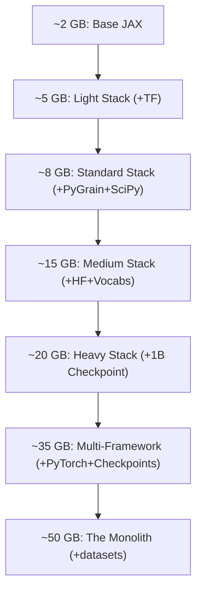

# Benchmark Plan: GKE Image Streaming vs. Standard Pull (Real ML Workload)

This document outlines a proposed benchmarking plan to evaluate **GKE Image Streaming (GCFS)** against **Standard Image Pulls** using a representative, real-world JAX training workload (AXLearn Fuji model) instead of artificial dummy layers.

---

## 🎯 Objectives
1. **Measure Time-to-First-Step (TTFS):** Capture the true end-to-end latency from Pod scheduling to the completion of the first training step.
2. **Quantify FUSE Import Overhead:** Isolate how importing heavy ML libraries (TensorFlow, PyGrain) impacts startup under Image Streaming.
3. **Identify the Real Inflection Point:** Determine the exact image size at which Image Streaming becomes a net benefit when running a realistic ML stack.
4. **Evaluate Active Training Impact:** Verify if Image Streaming introduces ongoing latency during the training loop (e.g., when loading data or reading local assets).

---

## 💻 Benchmark Workload: Fuji Training Job
Instead of an idle container or a simple JAX import, the benchmark will run a simplified **Fuji (LLaMA-style) GPT training job** configured in [fuji.py](axlearn/experiments/text/gpt/fuji.py).

*   **Model Configuration:** `fuji-test` or `fuji-1B` (to keep compilation times reasonable while remaining architecturally representative).
*   **Data Pipeline:** A real `tf.data` or `pygrain` pipeline that:
    1.  Imports `tensorflow` and `axlearn.experiments.text.gpt.c4_trainer`.
    2.  Loads training data from a public GCS bucket (e.g., C4 dataset).
    3.  Performs a simple `train_step` (triggering JAX initialization, XLA compilation, and first step execution).

---

## 📦 Proposed Image Configurations & Granular Size Matrix

To simulate realistic customer images and find the exact performance crossover point, we propose **seven distinct image sizes**. Instead of passive zero-bytes, we inflate the images by adding **real, functional software layers and local assets** that JAX/Python will actually interact with.

### 1. Lightweight Base Image (~2 GB)
*   **What it represents:** A minimalist, highly optimized JAX training image.
*   **Contents:** Core JAX, Flax, AXLearn, and basic dependencies.
*   **How it's built:** Standard `tpu` target in the [Dockerfile](Dockerfile).
*   **Expected Behavior:** Standard Pull should win easily. GCFS FUSE overhead during JAX initialization will outweigh the tiny pull savings.

### 2. Lightweight ML Stack (~5 GB)
*   **What it represents:** A simple JAX training image that uses TensorFlow solely for data loading.
*   **Contents:** Base Image + `tensorflow-cpu` (minimal installation).
*   **How it's built:** Install only JAX and TensorFlow.
*   **Expected Behavior:** This bridges the gap to see the immediate impact of introducing a heavy framework like TensorFlow on GCFS import times.

### 3. Standard ML Stack (~8 GB)
*   **What it represents:** A typical customer image containing multiple frameworks and data loaders.
*   **Contents:** Base Image + full `tensorflow-cpu` + `pygrain` + scientific stack (`scipy`, `pandas`, `scikit-learn`, `matplotlib`).
*   **How it's built:** Modify `Dockerfile` to install these heavy packages.
*   **Expected Behavior:** **The beginning of the inflection zone.** Standard Pull will take ~35-45s, while GCFS will start in ~2s but suffer import lag.

### 4. Medium ML Stack + Vocabularies (~15 GB)
*   **What it represents:** A very common NLP training setup where the model is initialized from scratch, but utilizes heavy NLP libraries and local tokenizer configurations.
*   **Contents:** Standard ML Stack (~8GB) + HuggingFace (`transformers`, `tokenizers`) + local TikToken/SentencePiece vocabularies.
*   **How it's built:** Install HF libraries and copy several large vocabulary files (~7GB total) into the image.
*   **Expected Behavior:** **The predicted mathematical inflection point.** This is a critical test case. The vocabularies are read during startup, which will test GCFS's ability to handle medium-sized file reads without stalling the JAX sync.

### 5. Heavy ML Stack + Local Checkpoint (~20 GB)
*   **What it represents:** An enterprise image containing the model definition, libraries, and a reference model checkpoint.
*   **Contents:** Medium ML Stack (~15GB) + a small reference model checkpoint (e.g., 1B parameter checkpoint, ~5GB of weights) embedded in the image for local initialization.
*   **How it's built:** Copy a 1B checkpoint file into the container image.
*   **Expected Behavior:** GCFS should begin to show a clear net benefit in TTFS, provided the on-demand read of the 5GB checkpoint file over FUSE does not bottleneck the startup.

### 6. Multi-Framework / Multi-Model Dev Image (~35 GB)
*   **What it represents:** A shared developer image containing multiple frameworks and checkpoints for different tasks.
*   **Contents:** Heavy ML Stack (~20GB) + `torch` (PyTorch) + additional model checkpoints (e.g., multiple 1B/3B variants).
*   **How it's built:** Install PyTorch and copy additional checkpoint files.
*   **Expected Behavior:** GCFS will save ~140s in pull time. This case will show if GCFS scales well when the image contains multiple unused frameworks (PyTorch won't be imported by our JAX job, so we can verify if unused layers indeed cause zero GCFS overhead).

### 7. The Monolith Image (~50 GB)
*   **What it represents:** A massive "all-in-one" image containing multiple model variants, complex validation tools, and local golden datasets.
*   **Contents:** Multi-Framework Image (~35GB) + large local validation datasets embedded in the image for offline regression testing.
*   **How it's built:** Copy large dataset tarballs into the image.
*   **Expected Behavior:** **Clear victory for GCFS in container startup.** However, we must closely monitor the active training loop. If the job reads these local datasets during runs, FUSE lag could degrade active training efficiency.

---

## 📊 Expanded Pros & Cons Comparison Matrix

Based on our architectural understanding, here is the projected performance comparison across the expanded list of sizes:

| Image Size & Config | GKE Image Streaming (Enabled) Pros | GKE Image Streaming (Enabled) Cons | Standard Pull (Disabled) Pros | Standard Pull (Disabled) Cons | Projected Winner (E2E TTFS) |
| :--- | :--- | :--- | :--- | :--- | :--- |
| **~2 GB** *(Lightweight Base)* | • Near-instant container start (~2s). | • High relative FUSE overhead during JAX import. | • Fast pull (~30s). • Max JAX import speed (local SSD). | • Slightly slower container start. | 🏆 **Standard Pull** |
| **~5 GB** *(Lightweight Stack)* | • Fast container start (~2s). | • FUSE latency from importing TensorFlow. | • Reliable, consistent import speed. | • Moderate pull delay (~20s). | ⚖️ **Neck-and-Neck** |
| **~8 GB** *(Standard Stack)* | • Fast container start (~2s). | • Increased FUSE latency (TF + PyGrain imports). | • Reliable, consistent import speed. | • Pull delay (~40s). | ⚖️ **Neck-and-Neck** |
| **~15 GB** *(Medium + Vocabs)* | • Saves ~60s of pull time. | • FUSE latency during imports and reading local vocab files. | • Zero filesystem latency at runtime. | • Heavy pull delay (~60s). | 🏆 **Image Streaming** *(Tight Margin)* |
| **~20 GB** *(Heavy + Checkpoint)* | • Saves ~80s of pull time. | • Potential read latency when loading the 5GB checkpoint over FUSE. | • Zero filesystem latency at runtime. | • Heavy pull delay (~80s). | 🏆 **Image Streaming** |
| **~35 GB** *(Multi-Framework)* | • Saves ~140s of pull time. • **Zero overhead for unused PyTorch layers.** | • Potential metadata sync overhead on large file structure. | • Zero filesystem latency at runtime. | • Severe pull delay (~140s). | 🏆 **Image Streaming** |
| **~50 GB** *(Monolith)* | • Prevents GKE timeouts. • Saves 3+ minutes of bootup time. | • **High risk of training loop lag** if local datasets are read during runs. | • Maximum stability once running. | • Dangerous pull times. • Risk of node disk exhaustion. | 🏆 **Image Streaming** *(With caveats)* |

---

## 🧪 Experimental Execution Steps

To run this benchmark, we will follow these steps:

1.  **Prepare the Images:** Create seven Dockerfiles reflecting the configurations above.
2.  **Establish a Baseline (Warm run):** Run the Fuji job once to measure the baseline JAX compilation time on local SSD.
3.  **Cold Start Benchmarks:**
    *   For each image size, provision a fresh TPU v6e node pool (wiping local caches).
    *   Submit the Fuji training job.
    *   Measure:
        *   `t_pull`: Time from Pod Scheduled to Container Started.
        *   `t_import`: Time from Container Started to first python log (measuring import overhead).
        *   `t_compile`: Time from first log to first step completion (measuring data load + XLA compile).
4.  **Analyze Step Time:** Run the training for 10 steps and measure the average step time to verify if GCFS interferes with the active training loop.
