# Draft Report: GKE Image Streaming vs. Standard Pull on TPU v6e (Realistic ML Workload)

> **Status:** 🚧 **Benchmark in Progress** (Running in background as Task `task-202`)  
> **Last Updated:** June 12, 2026

---

## 🎯 Executive Summary & Core Philosophy

This report documents the benchmarking experiment comparing **GKE Image Streaming (GCFS) Enabled** against **Standard Image Pulls (Disabled)** under a highly realistic, production-representative Machine Learning workload.

### ⚠️ Crucial Constraint: Startup Latency Only
To align strictly with production priorities, **this benchmark is ONLY interested in startup latency (Time-to-First-Step), NOT active training throughput.** 
Once a training job starts its second iteration, all container files have already been loaded into memory (or cached), and GKE Image Streaming has zero impact on subsequent step times. The critical bottleneck for ML platforms—especially in autoscaling, preemption-prone, or rapid-iteration environments—is **how fast a newly scheduled Pod can execute its very first training step.**

---

## 🧪 Experimental Design & Measurement Methodology

Instead of using passive "dummy layers" that are never read by the application, this benchmark runs a real, active training workload: a **Fuji (LLaMA-style) GPT model** configured in [fuji.py](axlearn/experiments/text/gpt/fuji.py) (using the `fuji-golden-run-test-v1` config, capped at 5 steps for rapid benchmarking).

We divide the startup latency into three highly distinct, measurable phases:

```mermaid
gantt
    title ML Startup Latency Phases (Time-to-First-Step)
    dateFormat  X
    axisFormat %s
    
    section GKE / Container
    Container Provisioning (t_pull)     :active, p1, 0, 10
    
    section Python / JAX
    JAX Init & Library Imports (t_import) :crit, p2, 10, 25
    
    section XLA / GCS
    XLA Compilation & Step 1 (t_compile)  :active, p3, 25, 45
```

1.  **Container Provisioning ($t_{pull}$):** 
    *   *Start:* Pod scheduled to the node.
    *   *End:* Container enters `Running` state.
    *   *What it measures:* Physical image download & decompression (Standard) vs. Virtual FUSE mount & metadata initialization (Image Streaming).
2.  **JAX Init & Library Imports ($t_{import}$):**
    *   *Start:* Container enters `Running` state.
    *   *End:* First python log printed by AXLearn.
    *   *What it measures:* The raw FUSE read latency when the python interpreter imports heavy frameworks like `tensorflow`, `tf.data`, and `pygrain` from the container filesystem.
3.  **XLA Compilation & Step 1 ($t_{compile}$):**
    *   *Start:* First python log printed.
    *   *End:* Completion of the first training step (printing of Step 1 loss).
    *   *What it measures:* The time to initialize the data pipeline (fetching the first batch from GCS) and compile the XLA graph on the 16 TPU v6e chips.

**Total E2E Startup Latency (TTFS) $= t_{pull} + t_{import} + t_{compile}$**

---

## 📦 Tested Image Spectrum (The 7-Size Matrix)

To find the exact physical size where GKE Image Streaming becomes a net victory, we construct seven distinct images. Instead of empty padding, we inflate them using a hybrid approach: installing real libraries to capture import overhead, and using dummy files to simulate the weight of large checkpoints and datasets.

1.  **~2.0 GB (Base JAX):** Core JAX, Flax, and AXLearn. Minimal JAX-only setup.
2.  **~5.0 GB (Lightweight Stack):** Base + TensorFlow. Measures the immediate impact of adding a massive framework.
3.  **~8.0 GB (Standard Stack):** Base + TF + PyGrain + SciPy + Pandas. A typical ML data-loading stack.
4.  **~15.0 GB (Medium Stack + Vocabs):** Standard + HuggingFace + 7GB of local tokenizer vocabularies. **The predicted inflection boundary.**
5.  **~20.0 GB (Heavy Stack + Checkpoint):** Medium + 5GB local reference model checkpoint. Tests GCFS large file read performance during initialization.
6.  **~35.0 GB (Multi-Framework Dev):** Heavy + PyTorch + extra checkpoints. Tests GCFS performance when the image contains heavy, unused layers (verifying the "zero overhead for unused layers" theory).
7.  **~50.0 GB (The Monolith):** Multi-Framework + 15GB of local validation datasets. A massive enterprise image.

---

## 📊 Benchmarking Results (Placeholder)

*The table below will be populated automatically by the background orchestrator script (`orchestrate_benchmark.py`) once all 14 cold-start runs complete.*

| Image Size (GB) | Streaming Mode | Provisioning ($t_{pull}$) | JAX Init ($t_{import}$) | Compile & Step 1 ($t_{compile}$) | Total TTFS (E2E) | Status / Notes |
| :--- | :--- | :---: | :---: | :---: | :---: | :--- |
| **~2.0 GB** | Disabled (Standard) | *Running...* | *Pending* | *Pending* | *Pending* | ⏳ Waiting for task |
| **~2.0 GB** | Enabled (GCFS) | *Pending* | *Pending* | *Pending* | *Pending* | ⏳ Waiting for task |
| **~5.0 GB** | Disabled (Standard) | *Pending* | *Pending* | *Pending* | *Pending* | ⏳ Waiting for task |
| **~5.0 GB** | Enabled (GCFS) | *Pending* | *Pending* | *Pending* | *Pending* | ⏳ Waiting for task |
| **~8.0 GB** | Disabled (Standard) | *Pending* | *Pending* | *Pending* | *Pending* | ⏳ Waiting for task |
| **~8.0 GB** | Enabled (GCFS) | *Pending* | *Pending* | *Pending* | *Pending* | ⏳ Waiting for task |
| **~15.0 GB** | Disabled (Standard) | *Pending* | *Pending* | *Pending* | *Pending* | ⏳ Waiting for task |
| **~15.0 GB** | Enabled (GCFS) | *Pending* | *Pending* | *Pending* | *Pending* | ⏳ Waiting for task |
| **~20.0 GB** | Disabled (Standard) | *Pending* | *Pending* | *Pending* | *Pending* | ⏳ Waiting for task |
| **~20.0 GB** | Enabled (GCFS) | *Pending* | *Pending* | *Pending* | *Pending* | ⏳ Waiting for task |
| **~35.0 GB** | Disabled (Standard) | *Pending* | *Pending* | *Pending* | *Pending* | ⏳ Waiting for task |
| **~35.0 GB** | Enabled (GCFS) | *Pending* | *Pending* | *Pending* | *Pending* | ⏳ Waiting for task |
| **~50.0 GB** | Disabled (Standard) | *Pending* | *Pending* | *Pending* | *Pending* | ⏳ Waiting for task |
| **~50.0 GB** | Enabled (GCFS) | *Pending* | *Pending* | *Pending* | *Pending* | ⏳ Waiting for task |

---

## ⚙️ Infrastructure & Control Parameters
*   **GKE Cluster:** `kuiyue-axlearn` in region `us-central1` (version `1.36.0-gke.2459000`).
*   **TPU Node Pool:** Spot VMs, machine type `ct6e-standard-4t` (TPU v6e), 4 nodes (16 chips total), topology `4x4`.
*   **Zone:** `us-central1-b` (for all TPU nodes).
*   **Registry:** `us-docker.pkg.dev/kuiyue-gke-dev/axlearn/tpu` (regional Artifact Registry).
*   **Data Source:** Public GCS bucket (simulated FAKE data source for speed, but imports are real).
